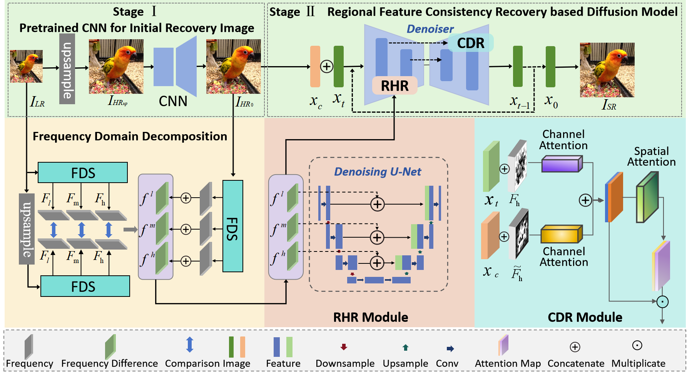

# Omni-frequency Diffusion-based Regional Feature Consistency Recovery for Blind Image Super-Resolution(DiffRCR)

## Brief

This is the implementation of paper: Chenjuan Zuo, Zhiqiang Wei, Xiaodong Wang, Jie Nie, Lei Huang*, Omni-frequency Diffusion-based Regional Feature Consistency Recovery for Blind Image Super-Resolution, Expert Systems with Applications, 2025.


## The Framework of the Proposed DiffRCR
<table border=0 >
	<tbody>
    <tr>
		<tr>
			<td width="40%" >  </td>
		</tr>
	</tbody>
</table>


## Datasets
Experiments on **3 image datasets**:
RealSR，DRealSR, DIV2K
### Datasets Download

|#|Datasets|Download|
|---|----|-----|
|1|RealSR|[Link](https://drive.google.com/file/d/17ZMjo-zwFouxnm_aFM6CUHBwgRrLZqIM/view)|
|2|DRealSR|[Link](https://drive.google.com/drive/folders/1tP5m4k1_shFT6Dcw31XV8cWHtblGmbOk)
|3|DIV2K|[Link](https://data.vision.ee.ethz.ch/cvl/DIV2K/)  |

 ### Environment
```python
pip install -r requirement.txt
```
 ### Data Prepare
```python
python data/prepare_data.py  --path [dataset root]  --out [output root] --size 64,256 -l
python function/get_fre.py
```
### Training/Resume Training

```python
# Use sr.py and sample.py to train the super resolution task.
# Edit json files to adjust network structure and hyperparameters
python sr.py -p train -c config/sr_sr3.json
```

### Test/Evaluation

```python
# Edit json to add pretrain model path and run the evaluation 
python sr.py -p val -c config/sr_sr3.json

# Quantitative evaluation alone using SSIM/PSNR metrics on given result root
python eval.py -p [result root]
```

## Acknowledgements

Our work is based on the following theoretical works:

- [Denoising Diffusion Probabilistic Models](https://arxiv.org/pdf/2006.11239.pdf)
- [Image Super-Resolution via Iterative Refinement](https://arxiv.org/pdf/2104.07636.pdf)

Furthermore, we are benefitting a lot from the following projects:

- https://github.com/lmnt-com/wavegrad](https://github.com/Janspiry/Image-Super-Resolution-via-Iterative-Refinement
- https://github.com/rosinality/denoising-diffusion-pytorch
- https://github.com/lucidrains/denoising-diffusion-pytorch

## Citation
If you find the code in this repository useful for your research consider citing it.
```
@article{zuo2025DiffRCR,
title={Omni-frequency Diffusion-based Regional Feature Consistency Recovery for Blind Image Super-Resolution},
journal={Expert Systems with Applications},
author={Chenjuan Zuo, Zhiqiang Wei, Xiaodong Wang, Jie Nie, Lei Huang},
year={2025}
}
```

